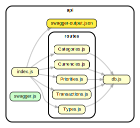
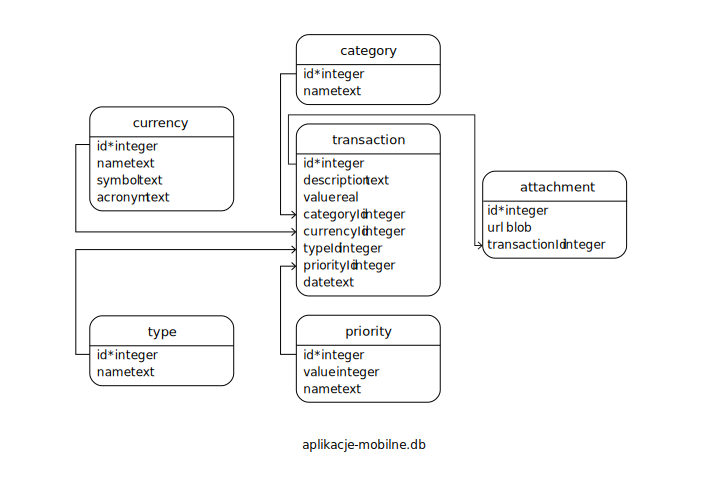
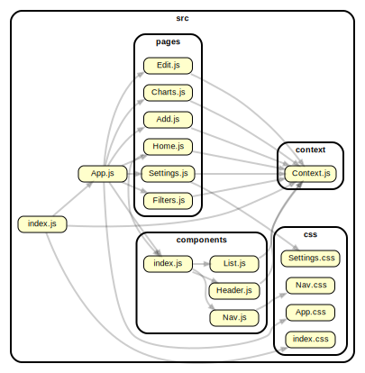

# Projekt. Aplikacja typu menedżer wydatków <br/> Mateusz Kłakus 2IO_II WSTI

# Instalacja projektu lokalnie

##

```bash
git clone https://github.com/Nokiusz/budget-tracker.git
cd budget-tracker
npm install
cd api
npm install
```

# Zbudowanie aplikacji

```bash
cd budget-tracker
npm run build
```

Tak zbudowaną aplikację (folder `./build`) można przenieść do katalogu `assets` w strukturze plików Android Studio.

# Uruchamianie API

```bash
cd api
npm run watch
```

# Funkcje zaimplementowane w aplikacji

- API napisane w node.js używające bazy danych SQLite,
- Wyświetlenie listy wszystkich wydatków/przychodów,
- Dodanie wydatków/przychodów na listę,
- Edycję wydatku/przychodu na liście,
- Usunięcie wydatku/przychodu z listy,
- Wyświetlenie w formie wykresu wydatków z danego miesiąca i/lub kategorii,
- Nadanie wydatkom priorytetu,
- Sortowanie wydatków (np. po kategorii/walucie/typie).
- Darkmode, ukrywanie wartości

# Dokumentacja REST API:

## Endpointy

### TRANZAKCJE

```js
GET    "/api/transactions" => zwraca obiekt zawierający wszystkie tranzakcje
GET    "/api/transactions/:id" => zwraca pojedyńczą tranzakcję o danym id
GET    "/api/transactions/list" => zwraca listę tranzakcji z polami 'id' podmienionymi na odpowiednie wartości z tabel słownikowych
GET    "/api/transactions/list/:id" => zwraca  tranzakcję o danym id z polami 'id' podmienionymi na odpowiednie wartości z tabel słownikowych
POST   "/api/transactions" => dodaje tranzakcje
DELETE "/api/transactions/:id" => usuwa tranzakcje o danym id
PUT    "/api/transactions/:id" => aktualizuje tranzakcje o danym id
```

POST body:

```json
{
  "description": "Test POST",
  "value": 3000,
  "categoryId": 2,
  "currencyId": 1,
  "typeId": 2,
  "priorityId": 1,
  "date": "29-04-2022"
}
```

#### TYPY

```js
GET    "/api/types" => zwraca obiekt zawierający wszystkie typy
GET    "/api/types/:id" => zwraca pojedyńczy typ o danym id
```

#### KATEGORIE

```js
GET    "/api/categories" => zwraca obiekt zawierający wszystkie kategorie
GET    "/api/categories/:id" => zwraca pojedyńczą kategorie o danym id
GET    "/api/categories/name/:name" => zwraca pojedyńczą kategorie o danej nazwie
POST   "/api/categories" => dodaje kategorie
DELETE "/api/categories/:id" => usuwa kategorie o danym id
PUT    "/api/categories/:id" => aktualizuje kategorie o danym id
```

POST body:

```json
{
  "name": "test category"
}
```

#### WALUTY

```js
GET    "/api/currencies" => zwraca obiekt zawierający wszystkie waluty
GET    "/api/currencies/:id" => zwraca pojedyńczą walutę o danym id
POST   "/api/currencies/" => dodaje walute
DELETE "/api/currencies/:id" => usuwa walute o danym id
PUT    "/api/currencies/:id" => aktualizuje walute o danym id
```

POST body:

```json
{
  "name": "test",
  "symbol": "t",
  "acronym": "TST"
}
```

#### PRIORYTETY

```js
GET    "/api/priorities" => zwraca obiekt zawierający wszystkie priorytety
GET    "/api/priorities/:id" => zwraca pojedyńczy priorytet o danym id
GET    "/api/priorities/name/:name" => zwraca pojedyńczy priorytet o danej nazwie
```

#### Dokumentacja Endpointów (Swagger)

```json
"/docs" => Dokumentacja API oraz możliwość wykonania żądań z poziomu przeglądarki
```

# Diagram API



# Diagram Bazy danych



# Frontend

Warstwa frontendowa aplikacji została napisana za pomocą języka `JavaScript` wraz z biblioteką `React.js`. Style aplikacji opierają się na systemie projektowania (Design system) `Ant Design`
# Diagram Frontend



